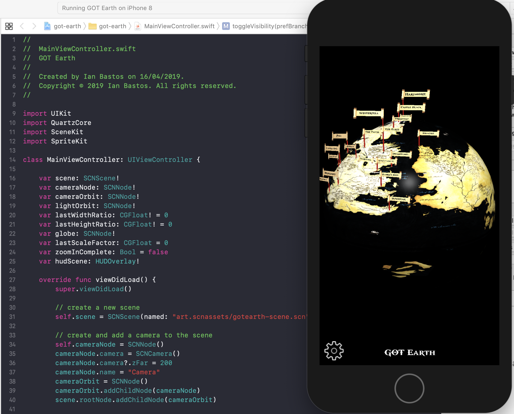
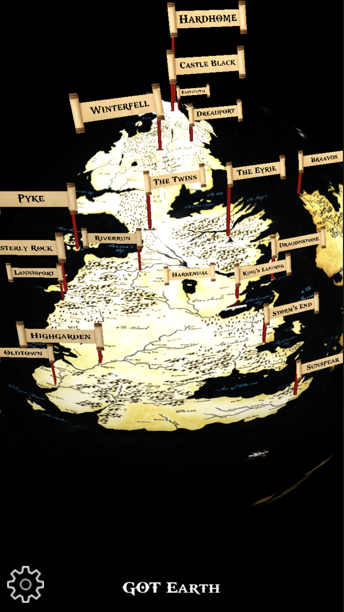
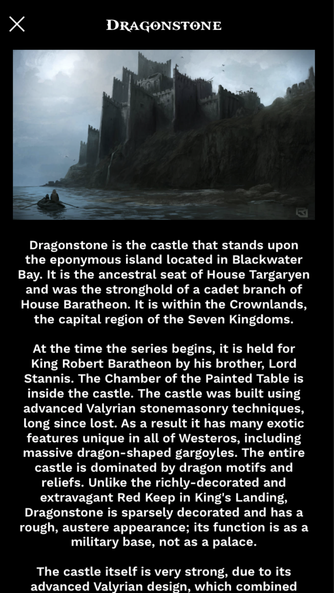

# GOT Earth (Game of Thrones Earth)

A fan based open source 3D game of thrones earth map

## Status: In Development

    

    
    

## Building

### Prerequisites

- You will need the latest version of Xcode installed on your system.
- You will also need Blender installed (for modelling)

### Build

- Load the project with Xcode
- From here you can just click Build and it will build and run

### Development

#### 3D Development
- Development consists of modelling the globe .blend file in the assets folder by adding new flag poles with the location names to the correct locations in the Game of Thrones universe
- Once that is done you can export the file to a .dae and load the .dae into the Xcode project
- In the Xcode project open the .dae file and click Editor > Convert to Scenekit format
- You might have to adjust the orientation of the globe as Blender uses a different orientation model to Xcode's SceneKit

#### Info View Development
- Once new locations are placed on the globe, one will need to update the entries for the information views that represent the location, ie the view that has an image and description of the place
- This is achieved by adding new entries to locale/en.json in the project
- The way it works is each entry must have the same name as the name of the location label in the 3D model for it to map touch events correctly
- Each entry maps to a 3-key dictionary which includes the data bindings for the title, image and description.
- Images are just the name of the images found in the resources folder and if fetched from another source - requires asking for permission to the content owner.

## Disclaimer
This is a non commercial product (it originally was going to be commercial hence it has some store code but it I ended up not having time and made it open source). This is a fan-based open source project and is not officially licensed by Game of Thrones.